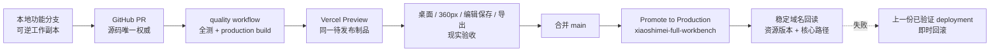

# 小师妹工作台：全量逻辑地图、问题挂点与修复备料

## 权威与发布传力链（2026-08-30）



本地 `~/.mesy/runtime/packages/xiaoshimei-studio-v2/` 只承载工作状态、生成图片与 Provider 回执；它不授予源码或生产权威。详细操作、发布 ID 与回滚点只记录在 `deployment/PRODUCTION_RUNBOOK.md`，避免在逻辑地图里形成第二份发布台账。

## 2026-08-30 根治审计：旧 PASS 被现实重新打开

当前正式域名虽然命中已记录部署，但用户在真实生成中再次给出封面串入 A/B/C、内页人物截头、重复标题层级、错字、图文比例失真、内容溢出和“已配置·未验证”状态反复等现场证据。因此 R30 只保留“部署与资源一致”的事实，不再证明作品可交付；CT03–CT05 重新进入待验证。以下根因矩阵是现有 U/D 问题的上层收敛，不建立第二份 Issue Registry。

| 根因 | 累计症状与原编号 | 根治机制 | 机器止损 | 当前证据 |
|---|---|---|---|---|
| RC1 模型被误当几何权威 | U02/U05/U10/U18，D02/D07/D08/D19/D23/D27/D29；封面带出底行、A/B/C 被截头 | 首张母版先识别真实 KV/插画分界，再按角色切片；不再固定从 2/3 下刀 | 分界证据不足即 `MOTHER_SHEET_KV_BOUNDARY_NOT_FOUND`，整组记 missing 并进入有界补绘，坏图不得进入排版 | `detectKvTemplateRegions` + 变形分界回归夹具 |
| RC2 内容容量没有成为生成约束 | U03/U04/U06/U11-U13/U16/U19/U20，D04/D05/D12/D15/D17/D21/D26；重复“第一养”、`养养法`、长文靠缩字硬塞 | 页眉/标题/panel 按格数设确定预算；重复层级、异常叠字和过密正文退回 Page Plan 重写 | `assertXhsPublishQuality` 在任何图片付费调用前执行；DOM 文本盒溢出继续阻断导出 | 新增质量门与重试提示回归 |
| RC3 多代 CSS 同时拥有几何 | U01/U08/U21/U22，D03/D06/D11/D14/D15/D18/D22/D28；3:4 口头成立但实际盒子被宽高竞争拉伸 | 从正式样式删除全部旧页面几何；`xhs-page-contract.css` 成为唯一可执行页面几何，HTML state 升至 v12；插图只给宽度，高度由 3:4 单轴推导 | 3:4/9:8、页边、对齐、无页码均由一个合同决定；DOM 比例与越界检查复核 | `styles.css` 零 `.html-page` 规则；271/271；本地五页实机零 overflow/零 warning，待 Preview |
| RC4 配置存在被冒充连接成功 | 顶部状态保存后短暂“在线”，轮询又变“未验证” | Provider 配置态与成功调用态分离；只在同一 provider/base/model 的真实成功调用后登记验证 | 换 Key 或模型立即清验证；health 无成功回执只能是 `CONFIGURED_UNVERIFIED` | session-scoped verified-call 回归通过 |
| RC5 测试和部署被误当作品验收 | U14/U15/U17，D12/D13/D20/D24；代码全绿仍可把肉眼可见坏版发上网 | 发布前必须在同一候选制品完成桌面、窄屏、逐页截图、编辑保存、真实 ZIP 与稳定域名回读 | 任一视觉/下载/核心旅程未现场通过，不允许从 Preview promote | 本地候选已逐页量测、编辑/撤销并真实下载 ZIP；Preview/Production 仍为 NOT RUN |

方法来源：约束式布局采用“模型提案 + 确定性约束/后处理”，参考 [LayoutFormer++](https://openaccess.thecvf.com/content/CVPR2023/papers/Jiang_LayoutFormer_Conditional_Graphic_Layout_Generation_via_Constraint_Serialization_and_Decoding_CVPR_2023_paper.pdf)、[LayoutRectifier](https://onlinelibrary.wiley.com/doi/10.1111/cgf.70273) 与 [Constrained Graphic Layout Generation](https://arxiv.org/abs/2108.00871)；浏览器视觉回归采用 [Playwright screenshot baselines](https://playwright.dev/docs/next/test-snapshots) 的稳定环境原则；图片取景遵循 [MDN object-fit](https://developer.mozilla.org/en-US/docs/Web/CSS/Reference/Properties/object-fit) 的裁切语义与 [Apple saliency crop](https://developer.apple.com/documentation/vision/cropping-images-using-saliency) 的主体保留原则；中文可读性与不裁字参考 [W3C 中文排版需求](https://www.w3.org/International/clreq/) 和 [WCAG Text Spacing](https://www.w3.org/WAI/WCAG21/Understanding/text-spacing)。未能从可访问的小红书官方公开文档确认统一的 3:4 尺寸条款；本项目的 1080×1440、KV 9:8、封面 1/3+2/3 是用户确认的产品合同，不冒充平台官方规范。

## 2026-08-31 未确认文字草稿丢失事故：最小可执行 Map Slice

本切片绑定当前用户明确指令形成的短生命周期 E1/E2 Task 边界：`object_ref=Products/Xiaoshimei-Studio-v2`，`goal=修复草稿保全、入口反馈与发布血缘`，`effect=本地可逆源码/合同/测试`。`TSK-260827-1821 / AIGC-D20` 的 object/goal/effect 不匹配，明确 hard reject，不能借它取得 Preview 或生产权限；生产提升必须另有同对象正式 Task、Authority 与 Writer 回读。

- `one_next_experiment`：本地同一候选 commit 已完成“未组装文字 → 新创作 → 返回 → 刷新”、真实焦点输入、390px 窄屏、跨稿发布双锁、旧成稿复制与 ZIP 实物回读；下一实验只能是在同一 commit 的 Preview 原样重放，再提升同一制品到稳定域名，禁止换 commit 后继承旧 PASS。
- `stop`：持久化未成功就切到空白稿、任一字段丢失、旧稿状态串入新稿、按钮无聚焦反馈、发布文案与确认文字不等、证据身份不全，或 Map 源 Hash 漂移。任一项发生就不得提升生产。

### 本次事故的当前生产事实

| 可观测结果 | 当前判定 | 不能被误读为 |
|---|---|---|
| 稳定域名点“新创作”后，未组装 `textDraft` 不在资产库，当前窗口切到空白稿 | `FAIL_CURRENT_PRODUCTION` | 用户误操作 |
| 资产库能重开旧 5 页 `content` | `PARTIAL_RECOVERY_ONLY` | 完整 authoring session 已保存 |
| 空白态“填写原文”未给出可见聚焦/光标反馈 | `FAIL_CURRENT_PRODUCTION` | 按钮已可用 |
| 同一轮用户回读中，“文字草稿”与“发布文案”语义发生独立改写 | `FAIL_CURRENT_PRODUCTION` | 发布文案已是确认文字的投影 |
| 本地候选完成新创作/返回/刷新、真实聚焦、跨稿副作用 0、旧稿 1.9 MB ZIP CRC 回读 | `PASS_LOCAL_FOR_FIX` | Preview、正式域名或用户现实结果已修复 |
| 本次修复的 Preview/正式域名同身份重放 | `NOT_RUN / NOT_APPLIED` | 旧部署或旧 dogfood 可代替新修复验收 |

```mermaid
flowchart TB
  subgraph NEWDRAFT["新创作事务"]
    UI_NEW["UI-NEW-CREATION<br/>用户点新创作"] --> ACT_NEW["ACT-NEW-DRAFT<br/>先保存，后切换"]
    ACT_NEW -->|"complete authoring snapshot"| STORE_SESSION["STORE-AUTHORING-SESSION<br/>draft/session/source/text/confirmation/image-plan/content"]
    STORE_SESSION -->|"write + readback PASS"| FLOW_BLANK["FLOW-ENTER-BLANK-DRAFT"]
    STORE_SESSION -.->|"FAIL：保留当前稿 + 可见错误"| UI_CURRENT["UI-CURRENT-DRAFT"]
    FLOW_BLANK --> UI_RETURN["UI-RETURN-PREVIOUS<br/>可见返回上一稿"] --> FLOW_RESTORE["FLOW-RETURN-PREVIOUS<br/>原子恢复同一 snapshot"] --> UI_CURRENT
    RULE_ATOMIC["RULE-ATOMIC-DRAFT-SWITCH<br/>无成功持久化即无界面切换"] --> ACT_NEW
    RULE_ATOMIC --> FLOW_RESTORE
  end

  subgraph SOURCECTA["原文入口反馈"]
    UI_SOURCE_CTA["UI-SOURCE-CTA<br/>填写原文"] --> ACT_FOCUS["ACT-FOCUS-SOURCE<br/>展开 + 滚动 + focus"] --> UI_SOURCE_INPUT["UI-SOURCE-INPUT<br/>输入框成为 activeElement<br/>焦点环与光标可见"]
  end

  subgraph CONTENTAUTH["文字与发布的单一内容权威"]
    ACT_CONFIRM["ACT-CONFIRM-TEXT"] --> STORE_CONFIRMED["STORE-CONFIRMED-TEXT<br/>draft_id + session_id + text_version/hash"]
    STORE_CONFIRMED --> RULE_CONTENT["RULE-SINGLE-CONTENT-AUTHORITY<br/>发布标题/正文/标签只投影当前已确认文字"] --> UI_PUBLISH["UI-PUBLISH-COPY"]
    RULE_LINEAGE["RULE-LINEAGE-GATE"] --> LINEAGE_MATCH{"当前 draft/session/text_version 相等？"}
    LINEAGE_MATCH -->|是| RULE_CONTENT
    LINEAGE_MATCH -->|否| BLOCK_PUBLISH["BLOCK-PUBLISH<br/>跨稿串状态"] --> RULE_ACTION["RULE-ZERO-SIDE-EFFECT<br/>原生 disabled + 执行函数二次校验<br/>复制/ZIP/旧链接调用数=0；保存仍可用"]
    ACT_EDIT_AFTER["ACT-EDIT-AFTER-CONFIRM"] -->|"显式 diff + 撤销确认态"| ACT_CONFIRM
  end

  subgraph EVIDENCE["证据与模型身份"]
    TEST_SURVIVE["TEST-UNASSEMBLED-DRAFT-SURVIVES"] & TEST_RETURN["TEST-RETURN-PREVIOUS"] & TEST_FOCUS["TEST-FOCUS-AFTER-CTA"] & TEST_CROSS["TEST-NO-CROSS-DRAFT-STATE"] & TEST_PUBLISH["TEST-PUBLISH-PROJECTION"] & TEST_ZERO["TEST-BLOCKED-SIDE-EFFECTS-ZERO"] --> RULE_EVIDENCE["RULE-EVIDENCE-IDENTITY<br/>task_id + commit_sha + deployment_id<br/>origin + browser_profile_id<br/>draft_id + generation_session_id + artifact_sha256"]
    RULE_EVIDENCE --> EVIDENCE_MATCH{"证据 identity 字段齐全且相等？"}
    EVIDENCE_MATCH -->|是| RELEASE_GATE["RELEASE-GATE"]
    EVIDENCE_MATCH -->|"否；旧证据不得跨 identity"| EVIDENCE_GAP["EVIDENCE_GAP<br/>BLOCK RELEASE"]
    RULE_MAP["RULE-MAP-SOURCE-INTEGRITY<br/>node source_ref/hash 必须与当前源字节一致"] --> MAP_MATCH{"Map 源 Hash 一致？"}
    MAP_MATCH -->|是| RELEASE_GATE
    MAP_MATCH -->|否| MODEL_ERROR["MODEL_ERROR<br/>禁止 ALIGNED / BLOCK RELEASE"]
  end
```



### 节点到源码/消费者测试的绑定

| 节点组 | `source_ref` | 必须运行的消费者证据 | 当前状态 |
|---|---|---|---|
| `ACT-NEW-DRAFT / STORE-AUTHORING-SESSION / FLOW-RETURN-PREVIOUS` | `src/main.jsx` + `src/workspace-state.mjs` | `TEST-UNASSEMBLED-DRAFT-SURVIVES` + `TEST-RETURN-PREVIOUS` + 持久化失败不切换 | `PASS_LOCAL_FOR_FIX / FAIL_CURRENT_PRODUCTION` |
| `UI-SOURCE-CTA / ACT-FOCUS-SOURCE / UI-SOURCE-INPUT` | `src/main.jsx` + `src/styles.css` | 真实点击后断言 panel 可见、`document.activeElement` 与可见 focus ring；源码正则不计 | `PASS_LOCAL_FOR_FIX / FAIL_CURRENT_PRODUCTION` |
| `STORE-CONFIRMED-TEXT / RULE-SINGLE-CONTENT-AUTHORITY / RULE-LINEAGE-GATE` | `src/content-engine.mjs` + `src/publication-authority.mjs` + `src/publication-action-guard.mjs` + `src/main.jsx` | `TEST-NO-CROSS-DRAFT-STATE` + `TEST-PUBLISH-PROJECTION` + 阻断态原生禁用与副作用调用数 0；允许态恰好 1 次 | `PASS_LOCAL_FOR_FIX / FAIL_CURRENT_PRODUCTION` |
| `RULE-EVIDENCE-IDENTITY / RULE-MAP-SOURCE-INTEGRITY` | 本地图 + `logic/logic-model.json` + `logic/reality-status.json` + `deployment/PRODUCTION_RUNBOOK.md` | 同一 identity 的 mechanism/Preview/桌面/窄屏/正式域名回读；逐个 `source_ref` SHA-256 与当前字节一致 | `NOT_RUN`；不得写 `ALIGNED` |

`STORE-AUTHORING-SESSION` 的最小完整载荷是 `schema_version / saved_at / draft_id / generation_session_id / source_topic / pillar / goal / text_requirements / title_candidates / selected_title / body / tags / text_confirmed / assembled_draft_id / image_plan / image_count / image_call_count / image_resume / content`；BYOK Key 不得进入该快照。旧 `content-only` 完整稿必须以显式 `CONTENT_ONLY` 模式打开并清空不相干 generation state，可继续编辑、保存与导出；一旦进入新文字流程，就必须在同一 `DraftRecord` 建立 confirmed lineage，禁止暗中沿用上一稿的 session。

上述 `RULE-EVIDENCE-IDENTITY` 对 mechanism/target/reality 三层都生效：必须是同一 Task、commit、deployment、origin/profile、draft/session 和 artifact，才能把测试、Preview 和浏览器回读串成一次 PASS。Map 是 intended model；`source_ref/hash` 与当前字节不一致时只能判 `MODEL_ERROR`，不得修改现实来配合地图，也不得保留 `ALIGNED`。

```mermaid
flowchart TB
  %% =====================================================================
  %% 图例与总目标
  %% =====================================================================
  classDef surface fill:#FFF7ED,stroke:#C2410C,color:#431407,stroke-width:1px;
  classDef current fill:#F8FAFC,stroke:#64748B,color:#0F172A,stroke-width:1px;
  classDef issue fill:#FFF1F2,stroke:#E11D48,color:#4C0519,stroke-width:1px;
  classDef debt fill:#FEF2F2,stroke:#B91C1C,color:#450A0A,stroke-width:1px,stroke-dasharray:5 3;
  classDef target fill:#ECFDF5,stroke:#059669,color:#022C22,stroke-width:1.5px;
  classDef phase fill:#EFF6FF,stroke:#2563EB,color:#172554,stroke-width:1.5px;
  classDef evidence fill:#F5F3FF,stroke:#7C3AED,color:#2E1065,stroke-width:1px;
  classDef gate fill:#FFFBEB,stroke:#D97706,color:#451A03,stroke-width:1.5px;
  classDef stop fill:#F1F5F9,stroke:#475569,color:#0F172A,stroke-width:1px,stroke-dasharray:5 3;

  GOAL["总目标：让小师妹从选题到发布包形成一条可编辑、可解释、可验收的 3:4 小红书图文生产链<br/>手机上字够大、图文有呼吸、主体不被乱裁、导出与编辑所见一致"]:::surface
  RULE["总原则：语义与版式先决定插图角色和槽位比例，裁剪最后执行；<br/>一个页面真相、一个导出真相、每次交付必须打开真实发布包验收"]:::gate
  GOAL --> RULE

  %% =====================================================================
  %% A. 当前完整逻辑
  %% =====================================================================
    subgraph NOW["A｜当前工作台完整逻辑：Reality readback 2026-08-31"]
    direction TB

    subgraph SURF["A1｜用户表面"]
      direction LR
      N01["新创作"]:::surface
      N02["研究选题"]:::surface
      N03["资产库"]:::surface
      N04["账号档案"]:::surface
    end

    subgraph CREATE["A2｜新创作五步旅程"]
      direction LR
      C01["1 原文<br/>主题、素材、历史、要求"]:::current
      C02["2 文字<br/>生成草稿、人工确认"]:::current
      C03["3 配图<br/>页面规划、母版生成"]:::current
      C04["4 排版<br/>智能版式或精细画布"]:::current
      C05["5 发布包<br/>PNG、文案、JSON、manifest"]:::current
      C01 -->|text brief| C02 -->|confirmed draft| C03 -->|content package| C04 -->|page render| C05
    end

    subgraph TEXTGEN["A3｜文字与页面计划"]
      direction LR
      T01["本地 HTTP Provider<br/>/text-draft"]:::current
      T02["结构化草稿<br/>标题、正文、页面角色"]:::current
      T03{"人工确认文字？"}:::gate
      T04["Page Plan<br/>cover / content pages<br/>hero / support / detail"]:::current
      T01 --> T02 --> T03
      T03 -->|是，才允许调图| T04
      T03 -->|否| C02
    end

    subgraph IMAGEGEN["A4｜当前插图生产链"]
      direction LR
      I01["buildIllustrationUnits<br/>scene / action / detail / comparison"]:::current
      I02["母版1：上两行合并 9:8 KV + 底行 A/B/C<br/>母版2起：3×3 D–L，按需续页"]:::current
      I03["图像模型生成母版"]:::current
      I04["Sharp 先识别真实 KV/A-B-C 分界再按角色切片<br/>分界不可信则 fail closed；KV 1080×960；插图 1080×1440"]:::current
      I05["面板资产<br/>保留 role / aspect / presence / edge metadata"]:::current
      I01 --> I02 --> I03 --> I04 --> I05
    end

    subgraph PACKAGE["A5｜内容包与当前版式决策"]
      direction LR
      PAK01["Content Package<br/>pages + panels + image assets"]:::current
      PAK02["Page Plan + Design Program v1<br/>整组构思：composition / focal order / rhythm<br/>image edge/scale / title measure / whitespace"]:::current
      PAK03["design-program.mjs<br/>枚举与范围约束；semantic hero 优先<br/>旧稿确定性回退"]:::current
      PAK04["html_state v12 + 单一 page contract<br/>设计程序 + 用户版式/取景/对象编辑<br/>同一可回载状态"]:::current
      PAK05["DOM / 像素几何评分<br/>overflow、重叠、比例、图片存在性"]:::current
      PAK01 --> PAK02 --> PAK03 --> PAK04 --> PAK05
    end

    subgraph DUAL["A6｜两套整页真相"]
      direction LR
      H01["HTML 智能版式<br/>cover-poster / editorial-notes<br/>visual-story / spatial-list"]:::current
      H02["DOM 文字可编辑<br/>Grid/Flex + container units"]:::current
      H03["HTML 图片取景<br/>focalX / focalY / zoom<br/>粗糙 72×72 边缘色检测"]:::current
      F01["Fabric 精细画布<br/>绝对坐标对象、拖动缩放"]:::current
      F02["独立状态与独立导出路径"]:::current
      PAK05 --> H01 --> H02 --> H03
      PAK05 --> F01 --> F02
    end

    subgraph CROPNOW["A7｜当前图片适配"]
      direction LR
      CR01["生成源与消费槽共用 3:4；封面共用 9:8"]:::current
      CR02["默认 zoom=100%；主体焦点只改变取景"]:::current
      CR03["单一 page contract 决定槽位与页边"]:::current
      CR04["自由编辑只保存有界 delta<br/>不重写规范几何"]:::current
      CR01 --> CR02 --> CR03 --> CR04
    end

    subgraph EXPORTNOW["A8｜导出、保存与反馈"]
      direction LR
      E01["HTML：html2canvas<br/>检查画布非空与图片区域"]:::current
      E02["Fabric：导出 PNG<br/>当前缺非空与图片区域检查"]:::debt
      E03["publish-package<br/>只验 PNG 签名与尺寸"]:::debt
      E04["JSZip：5 张 PNG<br/>发布文案、content、manifest<br/>当前未证明发布文案只投影 confirmed text"]:::debt
      E05["localStorage 资产库<br/>当前只可恢复已组装 content<br/>未确认 textDraft / lineage 不完整"]:::debt
      E06["24h / 72h / 7d Reality Feedback<br/>尚未反哺版式与裁剪 fitness"]:::debt
      E01 --> E03
      E02 --> E03
      E03 --> E04 --> E05 --> E06
    end

    subgraph OTHERFLOW["A9｜其他工作流"]
      direction LR
      R01["研究选题<br/>/api/jobs/research 轮询"]:::current
      R02["选中题目回填新创作"]:::current
      L01["资产库<br/>历史内容、发布包、反馈"]:::current
      A01["账号档案<br/>人设锁、Provider、Keychain"]:::current
      B01["Workspace<br/>备份、恢复、生成设置"]:::current
      R01 --> R02 --> C01
      E05 --> L01
      A01 --> C01
      B01 --> C01
    end

    N01 --> C01
    N02 --> R01
    N03 --> L01
    N04 --> A01
    C02 --> T01
    T04 --> I01
    I05 --> PAK01
    C04 --> H01
    C04 --> F01
    H03 --> CR01
    F02 --> CR01
    H03 --> E01
    F02 --> E02
    E04 --> C05
  end

  RULE --> N01

  %% =====================================================================
  %% B. 全量问题，逐条保留编号并挂到现状与修复域
  %% =====================================================================
  subgraph PROBLEMS["B｜全量问题清单：用户反馈 + 现场代码与发布包发现"]
    direction TB

    subgraph USERISSUES["B1｜用户明确反馈"]
      direction TB
      U01["U01 整体 UI、排版、字体不够精致｜挂点 A6｜修复 P4/P5"]:::issue
      U02["U02 竖屏插图像被强裁成横屏｜挂点 A4/A7｜修复 P2/P3"]:::issue
      U03["U03 图文太规矩、PPT 感、少灵动与人味｜挂点 A5/A6｜修复 P4"]:::issue
      U04["U04 图文太贴边、缺安全区和呼吸｜挂点 A5/A6｜修复 P4/P7"]:::issue
      U05["U05 图片白边；需要稳健去边，不是盲目放大｜挂点 A4/A7｜修复 P2/P3"]:::issue
      U06["U06 默认版式没有吃透 Desktop/ref｜挂点 A5/A6｜修复 P0/P4/P7"]:::issue
      U07["U07 改动看不出；不清楚旧稿是否需重新生成｜挂点 A6/状态持久化｜修复 P1/P5"]:::issue
      U08["U08 插图和文字偏小，不适合手机｜挂点 A6｜修复 P4/P7"]:::issue
      U09["U09 图应可移动可裁剪，文字可编辑｜挂点 A6/A7｜修复 P3/P5"]:::issue
      U10["U10 主体构图不协调，人物、手、动作、道具被切｜挂点 A4/A7｜修复 P2/P3"]:::issue
      U11["U11 HTML 智能排版会乱｜挂点 A5/A6｜修复 P4/P5"]:::issue
      U12["U12 页面底部多次溢出、截断或留大空洞｜挂点 A5/A6｜修复 P4/P7"]:::issue
      U13["U13 换个节奏每种都跑调｜挂点 A5/A6｜修复 P4/P5"]:::issue
      U14["U14 下载发布包曾出现整张空白｜挂点 A8｜修复 P6/P7"]:::issue
      U15["U15 交付前没有完整自检和 dogfood｜挂点 A8/全旅程｜修复 P0/P7"]:::issue
      U16["U16 总差点意思：缺主角、重点、节奏、图文语义配对｜挂点 A3/A5/A6｜修复 P1/P4"]:::issue
      U17["U17 常规修复仍反复索要审批，流程摩擦大｜挂点执行流程｜修复 P8"]:::issue
      U18["U18 图片裁剪与图文比例仍差｜挂点 A4/A5/A7｜修复 P2/P3/P4"]:::issue
      U19["U19 小红书模块未映射成 HTML 能力｜挂点 A6｜修复 P1/P4"]:::issue
      U20["U20 成品仍出现手机无意义小字｜挂点 A5/A6｜修复 P4/P7"]:::issue
      U21["U21 圆角矩形四角不对称且插图有灰边｜挂点 A6/A7/A8｜修复 P3/P4/P6"]:::issue
      U22["U22 内页圆角过重、交错图文未顺边对齐、裁剪入口不显眼｜挂点 A5-A7｜修复 P3/P4/P5"]:::issue
      U23["U23 新创作吞掉未确认文字，且没有返回上一稿｜挂点 A2/A8｜修复 P1/P5/P7"]:::issue
      U24["U24 填写原文按钮无聚焦/光标反馈，用户看到的是‘按不了’｜挂点 A2｜修复 P5/P7"]:::issue
      U25["U25 文字草稿与发布文案独立改写，用户不知道哪份才是成品｜挂点 A3/A8｜修复 P1/P5/P7"]:::issue
    end

    subgraph DISCOVERED["B2｜现场进一步发现"]
      direction TB
      D01["D01 HTML 与 Fabric 各自拥有整页状态和导出真相｜挂点 A6/A8｜修复 P1/P5/P6"]:::debt
      D02["D02 同图被母版切片、面板归一化、编辑器三次重构｜挂点 A4/A7｜修复 P1/P2/P3"]:::debt
      D03["D03 RESOLVED_LOCAL v13｜设计程序已加入整组视线顺序、节奏、图像份量、方向与留白｜挂点 A5｜待真实视觉签字"]:::gate
      D04["D04 固定百分比 frame + 字符数估高，不测真实 DOM｜挂点 A5｜修复 P4"]:::debt
      D05["D05 QA 不看视觉重量、主体完整、安全边距、留白节奏｜挂点 A5/A8｜修复 P4/P7"]:::debt
      D06["D06 全局 cover/overscan 混淆 hero、贴纸、细节、背景｜挂点 A7｜修复 P1/P3"]:::debt
      D07["D07 固定 3×3 且全格 3:4，无法服务多种目标槽位｜挂点 A4｜修复 P2"]:::debt
      D08["D08 固定 2% 内缩不识别真实网格线和背景｜挂点 A4｜修复 P2"]:::debt
      D09["D09 主体检测仅低分辨率颜色差，无脸、手、动作、道具｜挂点 A6/A7｜修复 P3"]:::debt
      D10["D10 缺统一 Asset IR：角色、alpha/subject/face/action/prop bbox、比例、fit、crop｜挂点 A4-A7｜修复 P1"]:::debt
      D11["D11 PARTIAL v13｜已有受约束 Design Program；Asset bbox 与现实反馈 fitness 仍缺｜挂点 A5/A6/A8｜继续 P3/P8"]:::gate
      D12["D12 测试重代码与几何，缺视觉金图、手机缩略、解压打开与按钮全旅程｜挂点 A8｜修复 P7"]:::debt
      D13["D13 Fabric 导出缺 blank/flat/image-region QA｜挂点 A8｜修复 P6"]:::debt
      D14["D14 旧 html/editor state 可保留旧版式，代码改了旧稿未迁移｜挂点 A6｜修复 P1/P5"]:::debt
      D15["D15 CSS 多层覆写、重复选择器、固定行高导致漂移｜挂点 A6｜修复 P4"]:::debt
      D16["D16 contentEditable 曾观察 React 崩溃风险，当前需回归复验｜挂点 A6｜修复 P5/P7"]:::debt
      D17["D17 REOPENED_PRODUCTION / PASS_LOCAL_CANDIDATE｜旧正式版被用户现场坏版推翻；新单一页面合同已本地逐页通过，待新 Preview｜挂点 A5/A6"]:::gate
      D18["D18 没有明确先定槽位再裁剪，裁剪被用来补救坏比例｜挂点 A5/A7｜修复 P1/P3"]:::debt
      D19["D19 生成提示词没有输出可裁剪余量与结构化 bbox｜挂点 A3/A4｜修复 P2/P3"]:::debt
      D20["D20 Reality feedback 已有但未进入 layout/crop fitness｜挂点 A8｜修复 P8"]:::debt
      D21["D21 字号 Gate 只检查正文，漏掉眉题、提示、品牌与页码｜挂点 A5/A8｜修复 P4/P7"]:::debt
      D22["D22 旧 figure 样式残留非对称 radius/shadow，覆盖角色化媒体策略｜挂点 A6/A7｜修复 P3/P4"]:::debt
      D23["D23 母版按前 N 个几何格顺序绑定，空白格会被当成页面插图并使后续图错位｜挂点 A4｜修复 P2/P7"]:::debt
      D24["D24 PASS_LOCAL_RECONFIRMED｜新候选在手机端真实打开编辑侧栏、生成并保存 ZIP；实物可解且 5×1080×1440｜挂点 A8"]:::gate
      D25["D25 对象点击事件冒泡会清空选中态，使移动/缩放控件看似存在却不可用｜挂点 A6｜修复 P5/P7"]:::debt
      D26["D26 编辑视口未暴露封面文字与图片间距问题，真实导出 PNG 才看到贴撞｜挂点 A6/A8｜修复 P4/P7"]:::debt
      D27["D27 母版固定 3:4 与内页近方形槽位冲突，再叠加全局 116% overscan，白边与主体过大只能二选一｜挂点 A4/A5/A7｜修复 P1-P4"]:::debt
      D28["D28 取景能力藏在通用编辑手势里且缩放无产品上限，用户无法发现也无法稳定控制｜挂点 A6/A7｜修复 P3/P5/P7"]:::debt
      D29["D29 REOPENED_PRODUCTION / PASS_MECHANISM_LOCAL｜旧固定 2/3 被现实推翻；新真实 KV 分界检测与失败补绘已回归，待 Preview BYOK｜挂点 A4/A8"]:::gate
      D30["D30 PASS_LOCAL｜Provider 配置存在不再冒充已验证；仅成功生成调用可进入已验证态｜挂点 A1/A8"]:::gate
      D31["D31 PASS_LOCAL｜重复层级、异常叠字与超容量文案在付费图片调用前退回重写｜挂点 A3/A5"]:::gate
      D32["D32 PASS_LOCAL_REALITY｜唯一页面几何合同、3:4 单轴推导、DOM 文本/越界门与真实导出已回读｜挂点 A5/A6/A8"]:::gate
      D33["D33 FAIL_CURRENT_PRODUCTION｜资产库保存 assembled content，不保存完整 authoring session｜挂点 A8｜修复 P1/P5"]:::debt
      D34["D34 FAIL_CURRENT_PRODUCTION｜打开另一稿可残留上一稿 text/session/image state，无 lineage gate｜挂点 A2/A3/A8｜修复 P1/P5/P7"]:::debt
      D35["D35 FAIL_TEST_COVERAGE｜旧合同测试只匹配源码 setter，不验证按钮后的消费者反馈与持久化结果｜挂点 A8｜修复 P7"]:::debt
    end

    ICROP["问题簇 CROP<br/>U02 U05 U10 U18<br/>D02 D06-D10 D18 D19"]:::issue
    ILAYOUT["问题簇 LAYOUT<br/>U01 U03 U04 U06 U08 U11-U13 U16 U19 U20<br/>D03-D05 D11 D15 D17 D21"]:::issue
    ISTATE["问题簇 STATE/EDITOR<br/>U07 U09<br/>D01 D14 D16"]:::issue
    IEXPORT["问题簇 EXPORT/QA<br/>U14 U15<br/>D12 D13"]:::issue
    ITRANSPORT["问题簇 PUBLIC TRANSPORT<br/>D24 D29"]:::issue
    IPROCESS["问题簇 PROCESS/LEARNING<br/>U17 D20"]:::issue
    IAUTHORING["问题簇 AUTHORING AUTHORITY<br/>U23-U25<br/>D33-D35"]:::issue

    U02 & U05 & U10 & U18 --> ICROP
    D02 & D06 & D07 & D08 & D09 & D10 & D18 & D19 --> ICROP
    U01 & U03 & U04 & U06 & U08 & U11 & U12 & U13 & U16 & U19 & U20 --> ILAYOUT
    D03 & D04 & D05 & D11 & D15 & D17 & D21 --> ILAYOUT
    U21 --> ICROP
    U21 --> ILAYOUT
    U22 --> ICROP
    U22 --> ILAYOUT
    U22 --> ISTATE
    D22 --> ICROP
    D22 --> ILAYOUT
    D23 --> ICROP
    D24 --> IEXPORT
    D25 --> ISTATE
    D26 --> ILAYOUT
    D26 --> IEXPORT
    D27 --> ICROP
    D27 --> ILAYOUT
    D28 --> ICROP
    D28 --> ISTATE
    D29 --> ITRANSPORT
    D24 --> ITRANSPORT
    D30 --> ITRANSPORT
    D31 --> ILAYOUT
    D32 --> ILAYOUT
    D32 --> IEXPORT
    U07 & U09 --> ISTATE
    D01 & D14 & D16 --> ISTATE
    U14 & U15 --> IEXPORT
    D12 & D13 --> IEXPORT
    U17 & D20 --> IPROCESS
    U23 & U24 & U25 --> IAUTHORING
    D33 & D34 & D35 --> IAUTHORING
  end

  I01 -.-> ICROP
  PAK02 -.-> ILAYOUT
  H01 -.-> ISTATE
  E03 -.-> IEXPORT
  E06 -.-> IPROCESS
  E04 -.-> IAUTHORING
  E05 -.-> IAUTHORING

  %% =====================================================================
  %% C. 目标架构：唯一推荐，但必须由原型和真实包证据转正
  %% =====================================================================
  subgraph TARGET["C｜唯一推荐目标：HTML_CANONICAL_HYBRID（待原型与真实发布包 Gate 转正）"]
    direction TB
    DEC0["Decision Evidence 当前结论<br/>BLOCKED · FULL_CONTRACT_REQUIRED<br/>因此这里只是唯一推荐假设，不是正式默认裁决"]:::gate

    subgraph CANON["C1｜一个规范数据真相"]
      direction LR
      IR00["Authoring Session IR<br/>原文 + text draft + confirmation + image plan + content<br/>draft/session/text version 同一 lineage"]:::target
      IR05["Confirmed Text Authority<br/>标题候选 + 最终标题 + 正文 + 标签<br/>发布文案只做确定性投影"]:::target
      IR01["Semantic Content IR<br/>Page → Header → Title → Lede → Sections → Highlight → Figure → Footer"]:::target
      IR02["Asset IR<br/>media_role · src · source_kind<br/>alpha/subject/face/action/prop bbox<br/>preferred_aspects · fit_policy · crop_candidates · manual_crop"]:::target
      IR03["Page Composition IR<br/>语义 block tree + density budget<br/>不把绝对 x/y 当页面真相"]:::target
      IR04["Versioned Migration<br/>旧稿显式 reapply/migrate，禁止静默沿用旧布局"]:::target
      IR00 --> IR05 --> IR01 --> IR03
      IR02 --> IR03
      IR03 --> IR04
    end

    subgraph ROLE["C2｜图片角色决定适配策略"]
      direction LR
      MR01["hero_scene<br/>允许 cover，但主体/动作安全"]:::target
      MR02["inline_sticker<br/>透明去边 + contain<br/>不强塞照片卡"]:::target
      MR03["evidence_detail<br/>保留手、道具、细节<br/>contain 或 fit-width"]:::target
      MR04["texture_background<br/>允许 cover"]:::target
      MR05["mother_tile<br/>先识别网格/背景去边<br/>再进入角色策略"]:::target
    end

    subgraph XHSHTML["C3｜小红书图文模块 → HTML 语义模块"]
      direction LR
      XM01["3:4 页面与安全区<br/>article.xhs-page"]:::target
      XM02["眉题/色条<br/>header + eyebrow"]:::target
      XM03["主标题<br/>h1"]:::target
      XM04["导语<br/>p.lede"]:::target
      XM05["每个核心观点<br/>section[data-role=step]"]:::target
      XM06["步骤标题 + 正文<br/>h2 + p"]:::target
      XM07["强调短语<br/>mark"]:::target
      XM08["角色化插图<br/>figure[data-media-role]"]:::target
      XM09["页脚/页码<br/>footer"]:::target
      XM10["装饰<br/>CSS background / pseudo-element<br/>不做成正文位图"]:::target
      XM01 --> XM02 --> XM03 --> XM04 --> XM05 --> XM06 --> XM07 --> XM08 --> XM09 --> XM10
    end

    subgraph ENGINE["C4｜扬长避短的渲染与编辑"]
      direction LR
      EN01["HTML 为整页 canonical renderer<br/>CSS Grid/Flex + container queries<br/>真实 DOM 测量与自然回流"]:::target
      EN02["文字先继续 DOM 编辑<br/>补 error boundary、undo、回归<br/>只有需求证据出现才上 Lexical"]:::target
      EN03["选中图片打开局部 crop overlay<br/>拖动、缩放、旋转<br/>百分比裁剪写回 Asset IR"]:::target
      EN04["Sharp 服务<br/>网格边界、alpha/背景 trim<br/>attention/entropy 仅产生候选"]:::target
      EN05["Fabric/Konva 降级为可选局部精修<br/>不能再拥有第二套整页真相"]:::target
      EN01 --> EN02
      EN01 --> EN03
      EN03 --> EN04
      EN01 --> EN05
    end

    subgraph EXPORTTARGET["C5｜一个导出真相"]
      direction LR
      EX01["等待 fonts.ready 与全部图片 ready"]:::target
      EX02["从 canonical DOM 导出<br/>先保留 html2canvas；对比 html-to-image"]:::target
      EX03["逐页检查非空、非纯色、文字区域、每个 figure 像素区"]:::target
      EX04["生成 ZIP 后自动解压检查<br/>再用 Finder/Preview 打开真实 PNG"]:::target
      EX05["编辑器、预览、发布文案、发布包<br/>使用同一 authoring/content/layout/crop lineage"]:::target
      EX01 --> EX02 --> EX03 --> EX04 --> EX05
    end

    DEC0 --> IR00
    IR02 --> MR01 & MR02 & MR03 & MR04 & MR05
    IR03 --> XM01
    XM10 --> EN01
    MR01 & MR02 & MR03 & MR04 & MR05 --> EN03
    EN01 --> EX01
  end

  %% =====================================================================
  %% D. 备料后实施的唯一流程
  %% =====================================================================
  subgraph REPAIR["D｜从备料到现实闭环的修复流程"]
    direction LR
    P0["P0 冻结基线<br/>Desktop/ref 两张参考<br/>当前 5 页发布包与 content JSON<br/>桌面/窄屏截图、问题编号、旧编辑状态"]:::phase
    P1["P1 统一合同<br/>Authoring Session + Confirmed Text + Content/Asset/Composition IR<br/>schema version + lineage + 非破坏迁移"]:::phase
    P2["P2 修母版切片<br/>吸收 huashu bbox/density/alpha 轮子<br/>Sharp 检测真实格线、背景、白边<br/>输出 tile metadata"]:::phase
    P3["P3 角色化构图<br/>media_role → slot ratio → crop candidate<br/>react-easy-crop 手动微调<br/>保存百分比 crop 与 undo"]:::phase
    P4["P4 HTML 语义排版<br/>模块库 + 编辑决策层<br/>真实 DOM 测量、手机字号、安全区、density/overflow solver<br/>内容过载时缩文、换版或拆页"]:::phase
    P5["P5 编辑器与草稿事务<br/>新创作先保存后切换；可见返回上一稿<br/>原文 CTA 聚焦反馈；旧稿显式迁移<br/>HTML 整页主引擎，Fabric 只留 legacy/局部精修"]:::phase
    P6["P6 导出收口<br/>单一 DOM export<br/>字体/图片 ready、每页内容检查<br/>ZIP 解压与系统预览 readback"]:::phase
    P7["P7 全旅程验收<br/>消费者交互断言 + visual golden + 360px 手机缩略<br/>新创作/返回/聚焦/跨稿/发布投影 + 所有按钮 dogfood<br/>5 页发布包逐张打开，与 Desktop/ref 对照"]:::phase
    P8["P8 Reality 学习<br/>实际使用者接受后再看 24h/72h/7d<br/>把真实阅读/互动反馈回灌 layout/crop fitness<br/>重复 Episode 足够时才触发 gene-skill"]:::phase
    P0 --> P1 --> P2 --> P3 --> P4 --> P5 --> P6 --> P7 --> P8
  end

  ICROP --> P2
  ICROP --> P3
  ILAYOUT --> P4
  ISTATE --> P1
  ISTATE --> P5
  IEXPORT --> P6
  IEXPORT --> P7
  IPROCESS --> P8
  IAUTHORING --> P1
  IAUTHORING --> P5
  IAUTHORING --> P7
  P1 --> IR00
  P2 --> MR05
  P3 --> EN03
  P4 --> EN01
  P5 --> EN05
  P6 --> EX01

  subgraph PRACTICE["D2｜2026-08-27 实践回灌：当前证据直接改写下一步"]
    direction TB
    EV01["R01 P3 PASS｜inline_sticker 右移 58.4%→62.4%，undo 回到 58.4%；zoom=1 保持 contain"]:::evidence
    EV02["R02 P4 PARTIAL｜第 3 页两种节奏均 720/720、无页脚碰撞；用户判定方向正确"]:::evidence
    EV03["R03 A12 FAIL｜第 3 页眉题 11.6px、页脚 10.7px；正文虽 20.3px，但小字 Gate 漏检"]:::stop
    EV04["R04 A13 FAIL｜第 1/5 页同构；第 2/4 页视觉重量失衡、图小空洞大，页面角色未充分分流"]:::stop
    EV05["R05 A10 FAIL｜现场 computed style：四角 radius 不等且 hero 残留 shadow；用户观察到灰边"]:::stop
    EV06["R06 A15 BLOCKED｜首次真实下载等待超时；不得声称发布包修复，须修后重跑 ZIP/PNG 实物验收"]:::stop
    EV07["R07 P4 PASS（本地）｜5 页按内容角色分流：hook 封面、judgment 主次、method 纵向三段、pitfall 双区、closing 图像叙事；均 720/720 且无告警"]:::evidence
    EV08["R08 A12 PASS（结构/运行时）｜导出字号下限约 48px，手机等效约 16px；删除微型品牌字，compact 不再突破正文下限"]:::evidence
    EV09["R09 A10 PARTIAL｜现场 computed style 四角统一 2.8cqw、shadow=none、背景透明；自适应去边测试 PASS；新 ZIP 实物边缘仍待验"]:::gate
    EV10["R10 A14 PASS（本地）｜图片焦点 58.4%→62.4%→undo 58.4%；文字编辑提交与 undo 回读，最终恢复原文"]:::evidence
    EV11["R11 P6 PASS（应用内）｜导出先后暴露第 2/3/4 页脚碰撞；逐项修正安全预算后，5 页像素 Gate 与 ZIP 组装进入 COMPLETE"]:::evidence
    EV12["R12 A15 PARTIAL｜浏览器未暴露 blob download 事件，文件系统未发现新 ZIP；旧 2026-08-25 发布包不能充当新证据"]:::gate
    EV13["R13 A17 PARTIAL｜已走版式切换、换构图、翻页、图像移动、文字编辑、undo、导出；破坏性删除未执行，窄屏与发布包实物闭环未全 PASS"]:::gate
    EV14["R14 P2/A15 PASS｜扫描母版全部 9 格并过滤背景格；真实有效槽位为 1,2,4,5,6,7,8，修复第 2 页空图与后续错位"]:::evidence
    EV15["R15 P6/A15 PASS｜下载改为本地 HTTP attachment + 服务端原子落盘；按钮现场生成新 ZIP，Desktop 实物可读"]:::evidence
    EV16["R16 P5/A14 PASS｜对象选择不再被冒泡清空；模块位移状态 0→2cqw，undo 回 0；文字与图片焦点编辑均可撤销"]:::evidence
    EV17["R17 P4/A13 PASS｜导出 PNG 暴露封面贴撞后修正 portrait 专用尺寸；实测文字到图片间距约 23.6px，无溢出告警"]:::evidence
    EV18["R18 P7 PASS（本地发布包）｜225/225 tests、build PASS、ZIP 六文件无 CRC 错误；3 张 PNG 均 1080×1440 并逐张目检"]:::evidence
    EV19["R19 A4/A7 PASS（现实重放）｜公网 API 不再给各页重复整张母版；2 张已付费母版经 Sharp 主体检测与有界去边切为 12 个独立 JPEG，页面回读 12 个不同 Hash，刷新后无存储告警"]:::evidence
    EV20["R20 HISTORICAL production_applied PASS FOR RELEASE IDENTITY｜Vercel dpl_2Zrubh7bf4nALw4uoUQVjDEJurn3 READY，稳定别名已指向当轮 CSS/API；只保留该旧 release 事实"]:::evidence
    EV21["R21 A15/P7 PASS（公网渲染实物）｜235/235 tests、build PASS；生产页面回载后导出 5 页 ZIP，8 个文件 CRC 全 PASS，5 张 PNG 均 1080×1440，逐页 contact sheet 目检无九宫格/白边/空图"]:::evidence
    EV22["R22 D24 REMAINS｜应用内 Blob 按钮会进入“再次下载发布包”，但内置浏览器仍不能给出文件系统路径；本轮用同一生产 UI 的 headless Chromium download/saveAs 取得可回读 ZIP，按钮文案不得单独算落盘"]:::gate
    EV23["R23 provenance PASS｜最终 content.json 保留完整原始素材、真实生成正文、5 标签、5 页与 12 个独立图片源；ZIP Hash=8f5199b51adb78831e187eb04c81d5efe413e04c0b0b74bd4a5e02e0a460da14"]:::evidence
    EV24["R24 P7/A10-A17 PASS（本地完整 dogfood）｜先文字确认、后 2 次付费母版调用（¥0.44），10 插画单元组装 5 页；保存/刷新、360px、编辑/undo、复制、下载、ZIP 解包与逐页目检全走通；256/256 tests + build PASS"]:::evidence
    EV25["R25 当前正式版漂移｜本轮动态分隔线、完整边带清理、语义换行与复制回退仅在本地构建；既有 Vercel 部署未包含最新修复，production_applied 不得沿用旧 PASS"]:::gate
    EV26["R26 A10-A17 PASS_LOCAL｜新母版=9:8 KV + A/B/C，封面=1/3 标题 + 2/3 KV；参考橙落地；258/258 tests + build；桌面/360px 五页无 overflow/告警，改字/移动/undo/保存刷新回读通过；未付费生图、未部署"]:::evidence
    EV27["R27 生产事故纠偏 PASS_LOCAL｜线上日志证实 generate-images 函数 200、浏览器 Failed to fetch；切片响应加入自适应字节预算与 4 MB 总闸；公网下载移除 local-only 探测；v11 迁移清掉旧标题/面板位移，v14 绑定左右列与 3:4 明确宽高。264/264 tests + build；五页窄屏无告警；新 ZIP CRC PASS、5×1080×1440 逐页目检，Hash=1dc44be370ccc2db178e85e74a8f61fa659e879708e76c6c6067ba9232f92d31。尚未部署、未重跑公网付费生图。"]:::gate
    EV28["R28 D29 PASS_PREVIEW｜dpl_EkcAFfJdCmcBxjzQCMkkwJdtF7ZE 用 BYOK 完成真实付费母版；缺失 page-4-hero 在同请求有界补绘，3 页/3 图回到浏览器并可编辑"]:::evidence
    EV29["R29 D17/D24/A14/A15 PASS_PREVIEW｜最终 dpl_E3eLycjdGTLSRXRKgtTJVYZmrJG4：268/268 + build；长标题无 overflow；undo→redo 恢复原编辑；保存刷新保留；Chrome 下载 ZIP 实物 1,560,041 bytes，CRC PASS，5×1080×1440，sha256=da279675ee39ba78e5f756e0c86dc7b2eb3e6cdb01bed920afda55dbb6ea5438"]:::evidence
    EV30["R30 HISTORICAL production_applied PASS FOR RELEASE IDENTITY｜Git main=e1e775f；Production=dpl_Cj8uAE9utVX3oyLf6auJHMi824kj Ready；当轮线上 CSS/JS 与已验收构建 SHA-256 一致；rollback=dpl_Afw8Q5Vai578FVs11waZvd24CYBp；不继承给本次事故"]:::evidence
    EV31["R31 根治候选 PASS_LOCAL_REALITY｜styles.css 不再含任何 html-page 几何，3:4 单轴推导；271/271 + build；476px 实机五页均 3:4、KV 9:8、内图 3:4、零 overflow/告警；改字/移动/undo；手机侧栏真实下载 ZIP，8 文件可解、5×1080×1440 并打开目检"]:::evidence
    EV32["R32 A18-A21 FAIL_CURRENT_PRODUCTION｜稳定域名现场：新创作吞未确认文字、无返回入口；填写原文无聚焦反馈；文字草稿与发布文案分叉；本次修复未上 Preview/生产"]:::stop
    EV33["R33 恢复只是 PARTIAL｜资产库可重开旧 5 页 content，但被新创作清掉的未组装 textDraft 不在其中；必须以用户已给原文重建，不得冒充无损持久化"]:::gate
    EV34["R34 A18-A22 PASS_LOCAL_REALITY｜299/299 tests + production build；未组装文字经新创作/返回/刷新逐字恢复；填写原文真实 focus 后键盘输入；390px 无横溢；跨稿复制/ZIP 原生禁用且副作用 0、保存可用；CONTENT_ONLY 复制恰好 1 次，1,917,150-byte ZIP 落盘并 CRC PASS。Preview/Production NOT RUN"]:::evidence
    EV01 --> P5
    EV02 --> P4
    EV03 --> U20
    EV03 --> D21
    EV04 --> D03
    EV04 --> D05
    EV05 --> U21
    EV05 --> D22
    EV06 --> P6
    EV07 --> P4
    EV08 --> A12
    EV09 --> A10
    EV10 --> A14
    EV11 --> P6
    EV11 --> A15
    EV12 --> A15
    EV13 --> A17
    EV14 --> D23
    EV14 --> P2
    EV15 --> D24
    EV15 --> P6
    EV16 --> D25
    EV16 --> P5
    EV17 --> D26
    EV17 --> P4
    EV18 --> P7
    EV18 --> A15
    EV19 --> P2
    EV19 --> A10
    EV19 --> A11
    EV20 --> A10
    EV21 --> A15
    EV21 --> P7
    EV22 --> D24
    EV22 --> P6
    EV23 --> A15
    EV24 --> P7
    EV24 --> A10
    EV24 --> A11
    EV26 --> A10
    EV26 --> A11
    EV26 --> A13
    EV26 --> A14
    EV26 --> A16
    EV26 --> A17
    EV27 --> D17
    EV27 --> D24
    EV27 --> D29
    EV27 --> P4
    EV27 --> P6
    EV27 --> P7
    EV28 --> D29
    EV28 --> P2
    EV29 --> D17
    EV29 --> D24
    EV29 --> A14
    EV29 --> A15
    EV29 --> P7
    EV30 -.->|旧 release identity，仅保留历史部署事实| CT03
    EV30 -.->|不得跨 identity 继承| CT04
    EV31 --> D17
    EV31 --> D24
    EV31 --> D32
    EV31 -.->|只证明旧几何切片| CT01
    EV31 -.->|不覆盖 authoring 事故| CT02
    EV32 --> D33
    EV32 --> D34
    EV32 --> D35
    EV32 --> A18
    EV32 --> A19
    EV32 --> A20
    EV32 --> A21
    EV32 --> CT01
    EV32 --> CT02
    EV32 --> CT03
    EV32 --> CT04
    EV32 --> CT05
    EV33 --> A18
    EV34 --> A18
    EV34 --> A19
    EV34 --> A20
    EV34 --> A22
    EV34 --> CT01
    EV34 --> CT02
    EV24 --> A12
    EV24 --> A13
    EV24 --> A14
    EV24 --> A15
    EV24 --> A16
    EV24 --> A17
    EV25 --> CT03
  end

  %% =====================================================================
  %% E. Skills、资料与轮子
  %% =====================================================================
  subgraph MATERIALS["E｜各环节 Skills、资料与可吸收轮子"]
    direction TB

    subgraph SKILLS["E1｜Skills 路由"]
      direction LR
      S01["architecture-compiler<br/>本图、Unit/Edge/Authority/Rollback"]:::evidence
      S02["decision-evidence<br/>默认架构候选与 FULL decision gate"]:::evidence
      S03["research-engineering<br/>官方资料、GitHub 轮子、反证"]:::evidence
      S04["design-experience + design-taste-frontend<br/>编辑判断、参考对照、桌面/窄屏审美验收"]:::evidence
      S05["engineering-systems<br/>schema、迁移、渲染、导出实现"]:::evidence
      S06["product-design:audit<br/>旅程、交互与可用性审计"]:::evidence
      S07["browser / agent-browser-verify<br/>按钮全旅程与截图"]:::evidence
      S08["computer-use<br/>Finder/Preview 打开真实 ZIP/PNG"]:::evidence
      S09["completion-truth<br/>五层完成真相"]:::evidence
      S10["skill-lifecycle-manager<br/>仅当外部轮子正式沉淀成 MeSy Skill 时交 mia-3<br/>普通代码依赖不冒充 Skill"]:::evidence
      S11["gene-skill<br/>仅在重复真实 Episode 形成证据后改规则"]:::evidence
      S12["aigc / imagegen<br/>角色化插图提示词与资产原型<br/>不负责最终文字排版"]:::evidence
    end

    subgraph LOCALWHEELS["E2｜本地轮子取舍"]
      direction LR
      W01["huashu-gpt-image-master<br/>吸收 extract_grid.py 的内容 bbox、密度扫描、透明紧裁<br/>改写为当前 JS/Sharp 合同"]:::evidence
      W02["img2046-main<br/>吸收 ReactCrop/Konva 的拖拽、对齐线、历史栈交互<br/>不照搬其疑似 percent/pixel 混用的裁剪实现"]:::evidence
      W03["小红书配图skill<br/>吸收封面/内页分类、一页一观点、手机可读、反 PPT QA<br/>不吸收禁止 HTML/CSS/canvas 与让模型直接画文字的生产方式"]:::evidence
      W04["Desktop/ref<br/>封面：大标题 + 大场景<br/>内页：纵向三段、重点高亮、插图贴合段落<br/>作为结构参考，不做像素级抄袭"]:::evidence
    end

    subgraph GITHUB["E3｜优先核验的成熟源代码与官方资料"]
      direction LR
      G01["react-easy-crop<br/>移动、缩放、旋转、pixel/percent crop、移动端"]:::evidence
      G02["Sharp resize/trim<br/>cover/contain、attention/entropy、边缘背景/alpha trim"]:::evidence
      G03["smartcrop.js<br/>edge/saturation/skin/boost 候选<br/>只做候选，不做唯一裁决"]:::evidence
      G04["MDN Container Queries<br/>让模块按自身容器回流"]:::evidence
      G05["html-to-image<br/>DOM → PNG/SVG 的对照导出候选"]:::evidence
      G06["Playwright screenshots/snapshots<br/>稳定环境中的元素截图与视觉回归"]:::evidence
      G07["react-konva<br/>局部自由对象精修，不做整页真相"]:::evidence
      G08["Lexical<br/>仅在文本编辑复杂度有证据时引入"]:::evidence
      G09["Apple Typography<br/>iOS 默认正文 17pt、最低 11pt<br/>工作台目标：1080 导出正文约 48–54px，手机等效 16–18px"]:::evidence
    end

    S01 --> P0
    S02 --> DEC0
    S03 --> P0
    S04 --> P4
    S05 --> P1
    S06 --> P7
    S07 --> P7
    S08 --> P6
    S09 --> P7
    S10 --> W01
    S11 --> P8
    S12 --> P2
    W01 --> P2
    W02 --> P3
    W03 --> P4
    W04 --> P0
    G01 --> P3
    G02 --> P2
    G03 --> P3
    G04 --> P4
    G05 --> P6
    G06 --> P7
    G07 --> P5
    G08 --> P5
    G09 --> P4
  end

  click G01 "https://github.com/ValentinH/react-easy-crop" "react-easy-crop"
  click G02 "https://sharp.pixelplumbing.com/api-resize/" "Sharp resize"
  click G03 "https://github.com/jwagner/smartcrop.js/" "smartcrop.js"
  click G04 "https://developer.mozilla.org/en-US/docs/Web/CSS/Guides/Containment/Container_queries" "MDN Container Queries"
  click G05 "https://github.com/bubkoo/html-to-image" "html-to-image"
  click G06 "https://playwright.dev/docs/test-snapshots" "Playwright visual snapshots"
  click G07 "https://github.com/konvajs/react-konva" "react-konva"
  click G08 "https://github.com/facebook/lexical" "Lexical"
  click G09 "https://developer.apple.com/design/human-interface-guidelines/typography" "Apple Typography"

  %% =====================================================================
  %% F. Acceptance、rollback、五层真相
  %% =====================================================================
  subgraph CLOSE["F｜验收、回滚与完成真相"]
    direction TB
    subgraph ACCEPT["F1｜必须同时满足的 Acceptance"]
      direction LR
      A10["A10 母版：首张=上方连续 9:8 KV + 底行 A/B/C<br/>后续=3×3 连续字母；无透明边、分隔线或邻格残片"]:::gate
      A11["A11 构图：封面上 1/3 标题、下 2/3 满宽贴底 KV<br/>正文插图 3:4；取景焦点 12–88%、缩放 100–180% 可保存"]:::gate
      A12["A12 手机：360px 预览正文等效 ≥16–17px<br/>标题、正文、图像层级清楚"]:::gate
      A13["A13 版式：无文字、图片、页脚溢出<br/>无无意的大块底部空洞<br/>每页只有一个明确视觉重点"]:::gate
      A14["A14 编辑：点图片立即出现‘裁剪 / 取景’，缩放有边界<br/>文字、模块移动、undo/redo 可用；旧稿迁移结果可解释"]:::gate
      A15["A15 导出：5 张 PNG 均非空、含预期图片区域<br/>ZIP 可解压，Finder/Preview 实际可打开"]:::gate
      A16["A16 参考：与 Desktop/ref 对照<br/>达到大字、纵向节奏、插图服务段落、非 PPT"]:::gate
      A17["A17 全旅程：每个按钮至少走一遍<br/>桌面与窄屏均现场截图验收"]:::gate
      A18["A18 草稿安全：新创作前原子保存完整 authoring session<br/>失败不切换；返回上一稿逐字恢复，确认前调图数仍为 0"]:::gate
      A19["A19 原文入口：点击后原文面板可见<br/>输入框=activeElement，焦点环和光标可见"]:::gate
      A20["A20 内容权威：发布标题/正文/标签 Hash 与当前 confirmed text 相等<br/>确认后改文必须显式 diff + 重新确认；跨稿 lineage mismatch 即阻断"]:::gate
      A21["A21 证据身份：同 task_id + commit + deployment + origin/profile<br/>+ draft/session + artifact hash；旧证据不跨 identity，Map 源 Hash 不一致即 MODEL_ERROR"]:::gate
      A22["A22 动作结果：阻断态使用原生 disabled + 函数内 lineage 二次校验<br/>复制/ZIP/旧链接副作用=0；允许态恰好执行 1 次；保存不受阻"]:::gate
      A10 & A11 & A12 & A13 & A14 & A15 & A16 & A17 & A18 & A19 & A20 & A21 & A22 --> PASSALL{"全部 PASS？"}:::gate
    end

    subgraph ROLLBACK["F2｜Rollback"]
      direction LR
      RB01["feature flag：HTML_CANONICAL_HYBRID"]:::stop
      RB02["保留现有 authoring snapshot / content JSON<br/>与旧 renderer 只读兼容"]:::stop
      RB03["迁移只新增 schema version；先回读后切换<br/>失败保留原稿，不清空当前状态"]:::stop
      RB04["任一关键验收 FAIL<br/>关闭 flag，回当前 dual mode<br/>保留失败快照与可复现实例"]:::stop
      RB01 --> RB02 --> RB03 --> RB04
    end

    subgraph TRUTH["F3｜Completion Truth 五层"]
      direction LR
      CT01["mechanism_ready<br/>PASS_LOCAL_FOR_FIX：统一 DraftRecord、原子切稿/返回、真实聚焦、lineage token、原生禁用 + 内层守卫均经本地消费者重放；<br/>不代表当前生产已修复"]:::evidence
      CT02["package_verified<br/>PASS_LOCAL_FOR_FIX：299/299、production build、桌面/390px 事故旅程、跨稿副作用 0、1.9 MB ZIP 实物 CRC 回读；<br/>Preview 同 identity 仍 NOT RUN"]:::evidence
      CT03["production_applied<br/>FAIL_CURRENT_FIX_NOT_APPLIED：旧 production deployment 事实保留，但其正在运行已确认缺陷；<br/>本次修复没有完成同 commit Preview 验收与生产提升"]:::stop
      CT04["runtime_operational<br/>PASS_LOCAL_CANDIDATE / FAIL_CURRENT_PRODUCTION：本地生产构建事故重放通过；稳定域名仍运行旧缺陷版本，Preview 同身份重放尚未运行"]:::stop
      CT05["reality_validated<br/>PASS_LOCAL_CANDIDATE / FAIL_CURRENT_PRODUCTION：浏览器与 ZIP 实物证明本地候选行为；用户稳定域名旅程与被删‘入秋’稿重建仍未闭环"]:::stop
      CT01 --> CT02 --> CT03 --> CT04 --> CT05
    end

    PASSALL -->|是| P8
    PASSALL -->|否| RB04
  end

  P7 --> A10
  P7 --> A18
  DEC0 -.->|必须由 P0-P7 的真实证据解除| PASSALL
```
