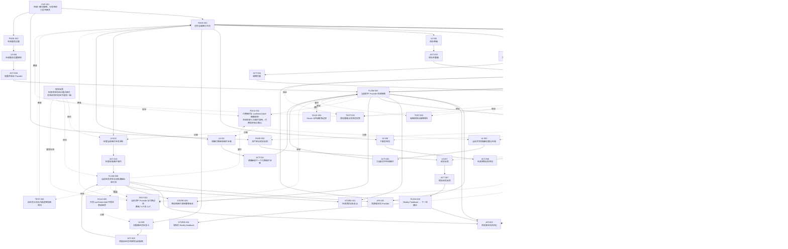
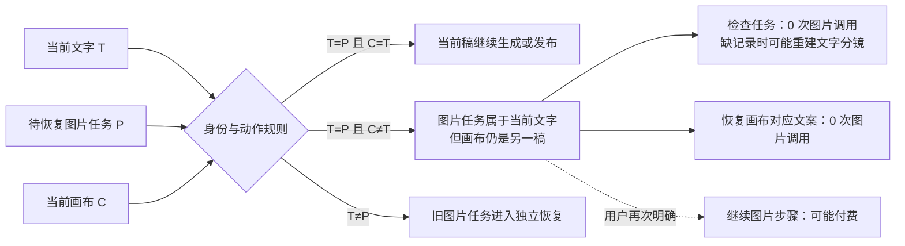

# 小师妹工作台｜图文交付主链逻辑地图（郭东超原版绘法）

> 只描述产品功能逻辑：用户看到什么、做什么、进入什么流程、调用什么、保存什么、哪些规则不能破、怎样验证。
>
> 本文件是唯一产品逻辑权威与人类入口；`logic/logic-model.json` 是同节点 ID 的机器投影，`logic/nodes/` 只负责逐节点追溯。三者必须由测试校验一致，任何 `RESOLVED` 都不能代替真实页面结果。
>
> 范围只含当前最短交付旅程“原文 → 文字 → 配图 → 排版 → 编辑 → 保存/重载 → 下载”及其恢复、反馈边界；研究选题和账号档案是上游辅助能力，不冒充这条交付旅程已经走通。

## 九个问题

| 类型 | 问题 | 小师妹答案 |
|---|---|---|
| CAP | 用户最终能完成什么？ | 完成一套可编辑、可保存、可发布的小红书图文 |
| PAGE | 在哪里完成？ | 创作工作台、稿件与反馈、生成服务设置 |
| UI | 用户看到或点击什么？ | 原文、确认文字、生成图片、检查状态、编辑、保存、下载 |
| ACT | 点击后实际做什么？ | 生成、确认、检查恢复、明确付费继续、编辑、保存、导出 |
| FLOW | 动作怎样流动？ | 创作、图文生成、任务恢复、编辑、发布包、反馈 |
| API | 调用什么？ | 生成服务、本机存取、下载 |
| STORE | 保存什么？ | 文稿、任务恢复点、画布媒体、发布包、反馈 |
| RULE | 什么绝不能被破坏？ | 同稿身份、检查零图片调用、明确付费、发布同稿、排版有效 |
| TEST | 怎样证明正常？ | 真实故障用例、生成恢复、保存重载、编辑导出、反馈回流 |

## 产品全景图

## 当前故障切片

截图对应 `T=P、C≠T`。因此“图片任务属于当前文字”和“当前画布不能按当前文字发布”可以同时成立，但界面必须解释这两个事实，不能把零图片调用的检查显示为“重试图片”。检查缺记录时可能调用文字模型，不可统称只读。

## 本轮逻辑审计

### 复核后的修复合同（本地验证，尚未上线）

范围：UI-009/010/011、ACT-009/010/011、FLOW-006、RULE-001/003/005、TEST-001/005，以及共用故障按钮、发布恢复入口。
当前反证：错稿禁止发布时仍提示可导出；无稿件 ID 的旧故障被任意 pending 稿接纳；按钮动作未按恢复类型分流；页数写死。

| 输入状态 | 点击后的行为 | 必须保留的不变量 |
|---|---|---|
| 有 pending 的未知/处理中/部分结果 | 发现原操作 | 不新建图片付费操作 |
| 零图片恢复故障但 pending 缺失 | 打开资产库找回原任务 | 不以新生成代替恢复 |
| 登录过期 | 打开现有访问验证入口 | 不调用图片模型 |
| 缺少本机媒体 | 打开现有资产库备份恢复入口 | 不调用图片模型 |
| 参考图过大 | 定位现有参考图设置 | 不调用图片模型 |
| 发布规则不允许，或画布为空 | 明确显示不可复制/导出 | 不宣称成品可用 |
| 故障缺稿件 ID 或 ID 不匹配 | 不恢复为当前稿故障 | 不能从 pending 存在推断故障归属 |
| 当前画布 N 页 | 恢复按钮使用实际 N 页 | 不固定写两页 |

验收：动作分流调用记录、真实发布判定组合、刷新归属反例、浏览器点击与保存/重载。测试数量与标签一致不能替代这些行为证据。

| 不合逻辑处 | 根因 | 修复后的唯一规则 |
|---|---|---|
| `IMAGE_STEP_UNKNOWN` 被当成未知故障 | Provider 码没有进入产品语义层 | 归一为 `UNKNOWN`，进入任务发现，不直接重试图片 |
| “检查状态”与“继续生成”共用重试按钮 | 把检查恢复与图片生成混成同一个动作 | 状态检查固定 0 次图片调用；付费续步必须是独立、明确动作 |
| `T=P、C≠T` 时两段提示互相打架 | 图片任务身份与画布发布身份只各说一半 | 同一提示同时说明“任务属当前文字、画布属另一稿、禁止发布” |
| 未确认、正文漂移等邻接状态被说成“可导出” | 恢复卡将“不是血缘冲突”等同于“发布已获准” | 由真实发布门返回值判断；保留 UNKNOWN/IN_FLIGHT/记录缺失原始原因，所有未通过发布门的状态明确保持锁定 |
| 恢复卡无证据地声称“还在恢复窗”或“只读” | 文案覆盖掉了已知失败原因，也未覆盖缺记录重建分镜分支 | 不推断恢复窗仍有效；明确检查零图片调用，但可能调用文字模型 |
| 画布错稿但没有 pending operation 时无出口 | 修复按钮错误依赖图片任务存在 | 只要发布门判定 `CONTENT_LINEAGE_MISMATCH`，就提供零图片调用的文案恢复 |
| 故障已持久化，刷新后界面却恢复成正常 | 启动流程应用 DraftRecord 时清空了同稿故障 | 只恢复与当前 `draft_record_id` 匹配的故障；跨稿故障拒绝串写 |
| 未分类图片故障仍显示“重试图片” | 默认文案掩盖动作成本 | 未证明零调用时必须显示“可能产生图片调用” |
| 人类 Mermaid 与机器地图节点含义漂移 | 两份地图只有形式关联，没有可执行一致性约束 | 稳定 ID、标签与含义由测试逐项对齐 |
| `task / impact / reality` 各自发布状态结论 | 多个权威面互相覆盖 | 全部退为指向本文件的只读入口；机器状态只在 JSON 投影 |
| 付费图片规则曾错误约束原文输入 `UI-001` | 关系边连错了对象 | `RULE-001` 只约束图片生成、状态检查和付费续步 `UI-003/010/011` |

本表覆盖当前交付主链及截图可达的一阶相邻节点；它不声称软件从此不存在任何未知缺陷。

## 当前现实

| 层级 | 回读 |
|---|---|
| 产品意图 | 以上九问图 |
| 本地机制 | 2026-09-05 复核修复：579/579 测试、生产构建通过；含动作调用记录、真实发布判定组合、无归属故障和刷新后付费边界反例 |
| 本地页面 | 最终构建使用本地服务替身回放：三页错稿点击检查仅发 DISCOVER；三页及八页恢复文案后刷新保持同稿；缺媒体/无原任务/参考图/验证入口点击分流；无归属旧故障不显示为当前稿故障，原 pending 仍可检查。替身不证明线上生成服务恢复 |
| 本地源码 | 工作分支基线 `e0075787370b3e95fccf5e1eeaa7738f4635d6ce`，另有本轮未提交修复 |
| GitHub main | `d8482ab4b26ef58f2497947724ae50670f18fc58` |
| 线上运行证明 | `/api/provider/health` 当前仍声明候选 commit `d8482ab4b26ef58f2497947724ae50670f18fc58` |
| 消费者现实 | 用户截图证明线上仍把 `IMAGE_STEP_UNKNOWN` 显示成“重试图片”；本地候选已通过精确故障回放，但尚未部署，不能称为已修复上线 |

## 使用方式

出现问题时只做四件事：

1. 把反馈连到最接近的 `UI / ACT / FLOW`。
2. 沿边检查相关 `API / STORE / RULE`。
3. 先补能复现现实的 `TEST`，再改代码。
4. 回到同一真实页面重走旅程；页面没好，就不写 `RESOLVED`。

原始方法来源：郭东超分享逐字稿，SHA-256 `da545e4fec3ecac4d89ac88068eb69091d7689761ac588f582145bcb8ff71f09`。
