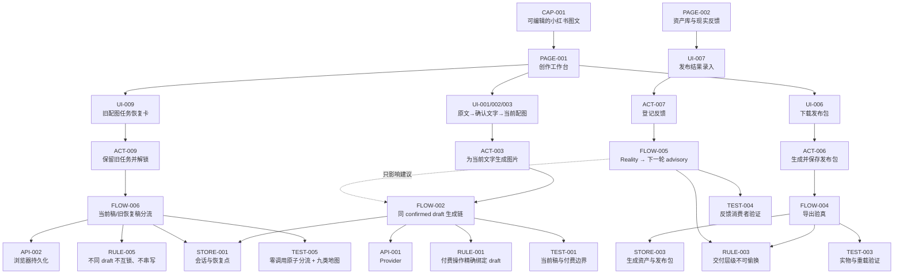

# 小师妹工作台 Current Logic Map v3.0.0

> **状态：CURRENT / runtime-bound**
>
> 这不是“把模块摆成一张图”。它按郭东超原版逐点回答九个问题，并用有类型的关系把答案连成可执行、可验证、可反馈的产品系统。机器权威在 `logic/logic-model.json`；每个节点的独立答案在 `logic/nodes/<ID>.md`。

## 每个点必须回答什么

| 类型 | 必须回答的问题 | 小师妹里的例子 |
|---|---|---|
| CAP | 最终给用户什么完整能力？ | 完成一套可编辑、可恢复、可发布的小红书图文 |
| PAGE | 用户在哪个页面完成哪段任务？ | 创作工作台、资产库、生成服务设置 |
| UI | 用户看到、编辑或判断什么？ | 当前配图面、旧任务恢复卡、发布包按钮 |
| ACT | 用户或系统执行什么动作？ | 生成当前配图、保留旧任务并解锁、导出 |
| FLOW | 动作如何跨状态、数据与失败边界？ | 当前稿生成、旧恢复稿分流、现实反馈回流 |
| API | 通过哪个明确接口读写？ | Provider、浏览器持久化、下载接口 |
| STORE | 哪份数据是权威，怎样恢复？ | DraftRecord、IndexedDB 媒体、图片恢复点 |
| RULE | 哪条约束绝不能绕过？ | 不同 confirmed draft 不得互锁或串写 |
| TEST | 怎么证明没退化？ | 单测、图契约、构建、生产与消费者 readback |

缺任一类、节点没有上下游、旅程没有规则和测试，都只能叫“图”，不能叫逻辑地图。

## 当前主图



## 四条关键旅程

1. **当前文字生成配图**
   `CAP-001 → PAGE-001 → UI-001 → ACT-001 → FLOW-002 → API-001 → STORE-001 → RULE-001 → TEST-001`

2. **旧任务保留并解锁新稿**
   `CAP-001 → PAGE-001 → UI-009 → ACT-009 → FLOW-006 → API-002 → STORE-001 → RULE-005 → TEST-005`

3. **编辑并导出发布包**
   `CAP-001 → PAGE-001 → UI-006 → ACT-006 → FLOW-004 → API-003 → STORE-003 → RULE-003 → TEST-003`

4. **真实反馈进入下一轮**
   `CAP-001 → PAGE-002 → UI-007 → ACT-007 → FLOW-005 → API-002 → STORE-004 → RULE-003 → TEST-004`

每条旅程都同时回答“用户要什么、在哪做、看到什么、做什么、怎么流、调什么、存哪、守什么、怎么验”。这才是地图，不是墙上贴满便利贴后集体假装导航已经完成。

## 本轮故障在地图上的位置

生产现场的事实是：当前文字 Draft ID 与 pending 图片任务冻结的 confirmed Draft ID 不同，但页面把“存在任意 pending”误当成“当前稿正在生成”，于是页数、模式、参考图、提示词等控件一起被锁。

修复后的判定：

```text
pendingTextDraftId == currentTextDraftId
  → 这是当前稿操作：只锁当前图片 Lane

pendingTextDraftId != currentTextDraftId
  → 这是旧稿恢复任务：显示独立恢复卡，不锁新稿控件
  → 可先 0 次 Provider 调用原子迁入 recovery sibling
  → 检查旧任务只做 DISCOVER
  → 继续 STEP 必须另一次明确标注付费的点击

draft identity 缺失
  → fail closed：不猜、不付费、不丢恢复点
```

迁移必须在同一 CAS 中完成“释放源 holder + 插入 recovery sibling”。冲突或读回不一致就保持原状；旧任务不会丢，新稿也不会被它继续“挟持”。

## 反馈闭环

```text
已发布标识 + 24h/72h/7d 指标 + 人工复盘
→ ACT-007 登记
→ FLOW-005 蒸馏为最多 3 条 / 2000 字符 advisory context
→ 下一轮文字与视觉建议
→ RULE-003 继续禁止它绕过 layout QA、付费门和发布验真
→ TEST-004 + 消费者 Reality readback
```

## 来源与边界

- 原始来源：郭东超分享逐字稿，SHA-256 `da545e4fec3ecac4d89ac88068eb69091d7689761ac588f582145bcb8ff71f09`
- 保留方法合同：`Skills/spec-driven-development/references/LOGIC_MAP_CONTRACT.md`
- 当前机器地图：`logic/logic-model.json`
- 节点答案：`logic/nodes/*.md`
- 当前入口：`src/main.jsx`
- 稳定公网入口：<https://xiaoshimei-full-workbench.vercel.app/>

地图表达 intended model，不冒充生产 Reality。代码、测试和构建只证明机制；上线后还要从稳定入口复现“旧任务不锁新稿、零调用分流可见、付费动作分开”才算生产生效。
