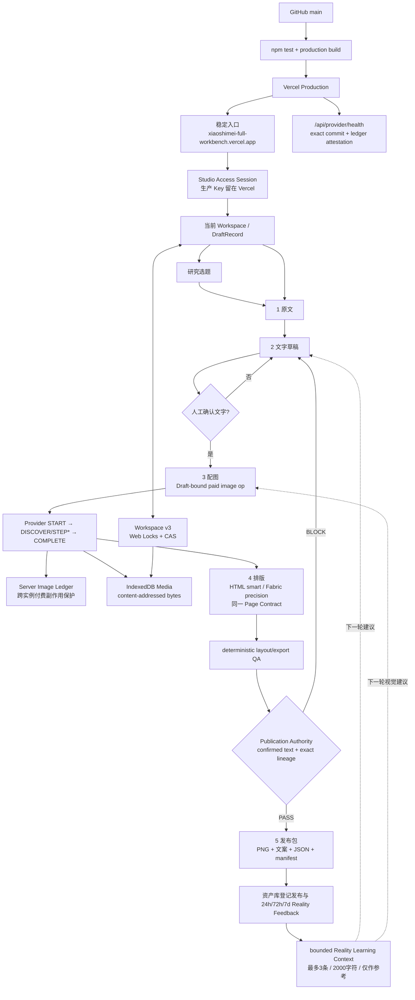

# 小师妹工作台 Current Logic Map v2.0.0

> **状态：CURRENT / runtime-bound**
> 这张图只描述当前有效产品逻辑，不再兼任事故史、发布台账或未来计划。历史 Rxx/Dxx 证据留在 Git/Tasks；机器真相见 `logic/logic-model.json`。

## 一张图



## 1. 用户实际看到的产品

| 面 | 唯一职责 | 不拥有的 Authority |
|---|---|---|
| 新创作 | 五阶段创作、编辑当前稿 | 不自行跳过文字确认/发布门 |
| 研究选题 | 研究并回填选题 | 不直接发布 |
| 资产库 | 回载稿件、备份、Reality Feedback | 不改变历史稿血缘 |
| 账号档案 | Profile v2 / 人设与内容约束 | 不保存 Production Key、不授予发布 |

## 2. 创作状态机

```text
原文 → 文字草稿 → 人工确认 → 配图 → 排版 → 发布包
                         │
                         └─ paid image: START → DISCOVER/STEP* → COMPLETE
```

- `creator-journey.mjs` 从当前事实推导阶段，UI 标签不构成阶段证据。
- 配图操作绑定 DraftRecord、confirmed copy 与调用预算；失败只续同一操作，冲突时写 recovered sibling，不覆盖用户新编辑。
- HTML 与 Fabric 是同一 Page Contract 的两种编辑器，不是两套作品状态。

## 3. 三个 Authority

### Workspace Authority
`Workspace v3 + Web Locks + CAS` 是本机稿件唯一持久化权威。DraftRecord 同时带 `content_package + generation_session`。媒体 bytes 独立存 IndexedDB，稿件只保存 hash ref。

### Paid-image Authority
Server Image Ledger 只负责跨实例付费调用、步骤缓存和恢复窗口，不替代 Workspace/IndexedDB。浏览器只有 exact media ref 通过 readback 后才允许持久化。

### Publication Authority
只有**当前已确认文字 + exact content lineage + current/assembled canvas**可以复制发布文案或导出 ZIP。保存、历史 feedback、pending recovery、UI 按钮状态都不能自己造发布权威。

## 4. Reality 学习闭环

旧链路到这里断了：

```text
发布后数据 → 保存 → 资产库
                   ✕ 没有消费者
```

现在是：

```text
已发布标识（published_at 或 published_url）
+ 24h/72h/7d 指标 + 人工复盘 + 已用 layout recipe
→ buildRealityLearningContext
→ 最多 3 条 / 2000 字符 / 明示“仅作参考”
→ 下一轮文字与图片 Provider context
→ 当前 deterministic QA / publication gate 继续裁决
```

所以“上次表现好”可以影响下一次建议，但永远不能直接让一个坏版式、串稿或第 7 次付费调用过门。

## 5. 部署与交付

```text
GitHub main
→ 完整 tests + production build
→ Vercel deployment
→ stable alias
→ exact HTML/JS/CSS + /api/provider/health + rollback readback
→ HANDOFF_READY
→ 独立真实使用者完成 fresh journey
→ CONSUMER_VALIDATED
```

`CONSUMER_VALIDATED` 不能由小师妹工作台自己签发。

## 6. 本轮关闭的问题

| 问题 | 结论 | 修复 |
|---|---|---|
| D20 | **RESOLVED** | Reality Feedback 进入下一轮 bounded advisory context；不接管 deterministic Authority |
| D32 | **RESOLVED** | 删除未被入口引用的 `src/App.jsx`，`src/main.jsx` 成为唯一 App 入口 |
| D33 | **RESOLVED** | Workspace v3 + DraftRecord + CAS，跨稿写入 fail closed |
| D34 | **RESOLVED** | confirmed text 是唯一 publish copy Authority |
| D35 | **RESOLVED** | paid image START/DISCOVER/STEP/COMPLETE + durable recovery |
| D36 | **RESOLVED** | Production server-managed credential + Studio Access Session + signed ledger readiness |

## 7. 与旧地图的关系

旧 `XIAOSHIMEI_WORKBENCH_FULL_LOGIC_MAP.md` 把 Current Map、事故史、Rxx 回执、未来方案和发布记录揉在一起，导致 Agent 每次都要读历史地层。本文件从 v2 起只保留 Current。

详细三方差异与证据见当前 MeSy Task：`INTAKE-13F71C425B7E647E`。
