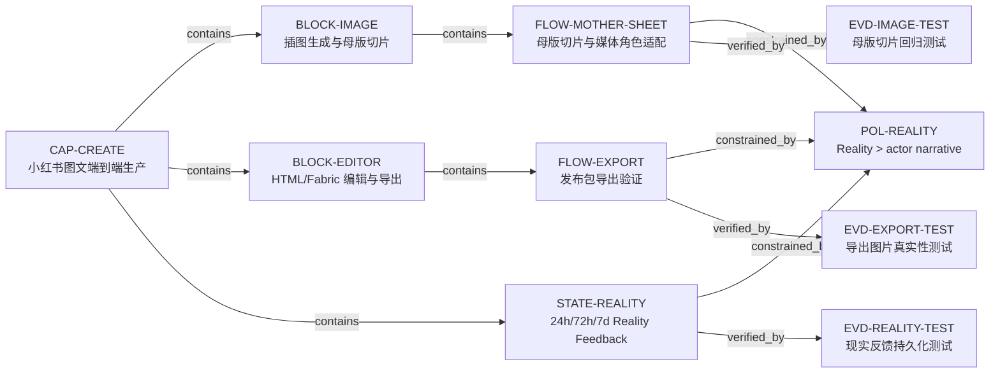

# Task View

## Problems
- `D08` · RESOLVED_CONFIRMED · 固定 2% 内缩不识别真实网格线和背景
- `D13` · RESOLVED_CONFIRMED · Fabric 导出缺 blank/flat/image-region QA
- `D17` · RESOLVED_LOCAL_V14 · 标题与图文行改为结构性 containment；五页窄屏与导出 PNG 无 overflow/overlap，待公网 Preview 回读
- `D24` · RESOLVED_LOCAL_PUBLIC_BRANCH · 公网下载不再探测本地 `/api/local-export`，直接走浏览器 attachment；待 Preview 实际下载回读
- `D29` · RESOLVED_LOCAL_BUDGET · 母版切片改为按总插图数分配传输预算，并在 4 MB JSON 前 fail-closed；待一次公网真实生图
- `D20` · OPEN_CONFIRMED · Reality feedback 已有但未进入 layout/crop fitness
