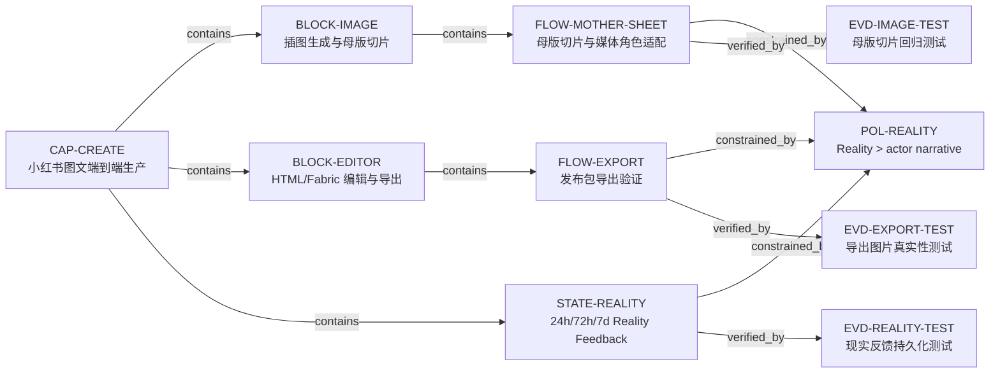

# Task View

## Problems
- `D08` · RESOLVED_CONFIRMED · 固定 2% 内缩不识别真实网格线和背景
- `D13` · RESOLVED_CONFIRMED · Fabric 导出缺 blank/flat/image-region QA
- `D17` · PASS_LOCAL_REALITY_ONLY · Production `dpl_Cj8uAE9utVX3oyLf6auJHMi824kj` 仍因用户现场坏版不可交付；新候选已删除全部旧页面几何 CSS，本地五页实机逐页 3:4/9:8、零 overflow、零 layout warning，尚待 Preview 视觉回读
- `D24` · PASS_LOCAL_REALITY_RECONFIRMED · 手机端真实打开编辑侧栏，生成并点击“保存发布包”；`~/Downloads/小师妹-发布包-2026-08-30T15-52-46-231Z-1.zip` 可解，8 个文件齐全，5 张 PNG 均为 1080×1440
- `D29` · REOPENED_BY_PRODUCTION_REALITY · 旧 Preview 证明过 BYOK 传输可用，但固定 2/3 切片仍会把实际母版分界切错；本轮改为真实分界检测、分界失败补绘，尚待新 Preview 的 BYOK 回读
- `D20` · OPEN_CONFIRMED · Reality feedback 已有但未进入 layout/crop fitness
- `D30` · PASS_LOCAL · Provider 配置态与成功调用验证态分离；换 Key/模型会清验证，271/271 回归通过
- `D31` · PASS_LOCAL · Page Plan 内容容量、重复层级、异常叠字在付费图片调用前 fail closed；271/271 回归通过
- `D32` · PASS_LOCAL_REALITY · `xhs-page-contract.css` 成为 HTML 成品唯一几何权威；`styles.css` 已无任何 `.html-page` 规则；HTML state v12；五页实机几何、编辑和导出均通过，待 Preview
