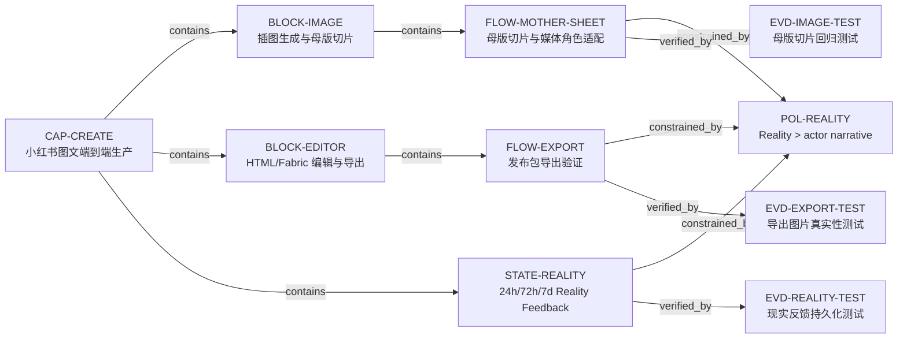

# Task View

## Problems
- `D08` · RESOLVED_CONFIRMED · 固定 2% 内缩不识别真实网格线和背景
- `D13` · RESOLVED_CONFIRMED · Fabric 导出缺 blank/flat/image-region QA
- `D17` · RESOLVED_PRODUCTION_V15 · Production `dpl_Cj8uAE9utVX3oyLf6auJHMi824kj` 命中已验收 CSS；长封面标题、5 页导出、桌面/窄屏无 overflow，标题与交错图文由结构性 containment 约束
- `D24` · RESOLVED_PRODUCTION_DOWNLOAD · 公网发布包先生成校验，再由可见下载链接保存；Chrome 实物已落到 Desktop，ZIP CRC 与 5×1080×1440 PNG 通过；正式域名命中同一 JS
- `D29` · RESOLVED_PRODUCTION_REAL_GENERATION · Preview `dpl_EkcAFfJdCmcBxjzQCMkkwJdtF7ZE` 已用 BYOK 完成真实付费母版并回到浏览器；生成链随后未改，最终同构制品已提升至 Production
- `D20` · OPEN_CONFIRMED · Reality feedback 已有但未进入 layout/crop fitness
